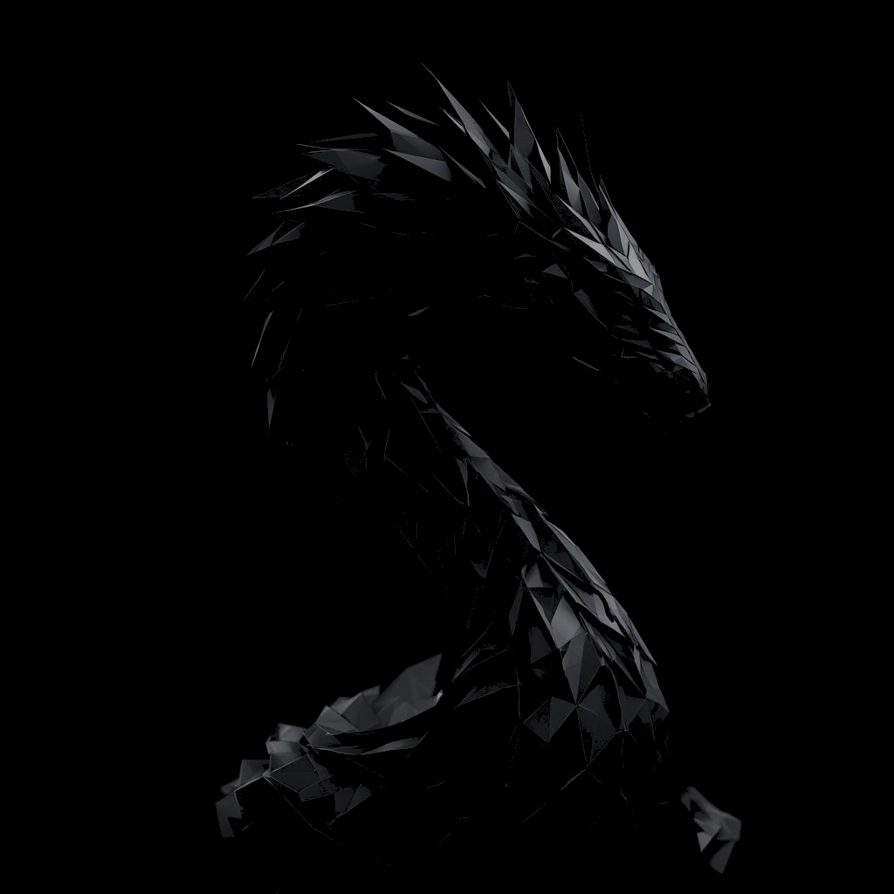
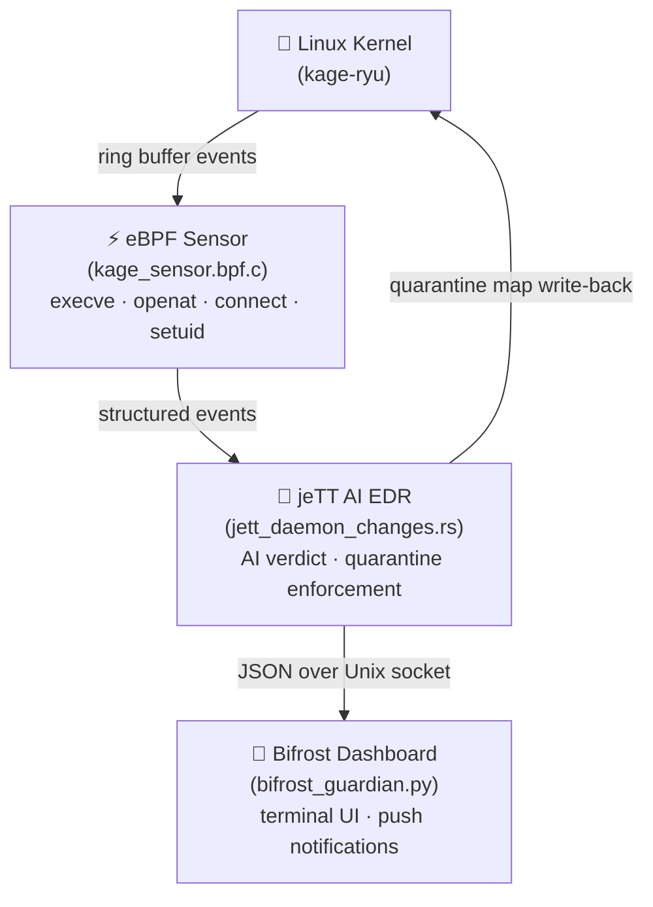

<div align="center">
  

  # kage-ryu — Shadow Dragon Kernel

  **Linux 7.0 + XanMod | AI Security | GowskiNet Security Lab**

  
  
  
</div>

---

## What it is

**kage-ryu** is a custom Arch Linux kernel built on the Linux 7.0 + XanMod base, tuned for low-latency desktop and workstation use on Intel-native hardware.

Beyond raw performance, the kernel ships with an integrated **eBPF security sensor stack** that intercepts system-call events in real time and feeds a structured event stream to two user-space daemons:

| Component | Role |
|---|---|
| **jeTT AI EDR** | User-space Rust daemon that consumes eBPF ring-buffer events, applies an AI-assisted verdict engine, and enforces quarantine by writing offending PIDs back into a kernel BPF map |
| **Bifrost dashboard** | Python daemon that authenticates jeTT verdicts over a Unix socket (SCM_CREDENTIALS), renders a live terminal dashboard, and dispatches push notifications on `QUARANTINE` events |

Together they form a continuous kernel → user-space → AI enforcement loop designed for security research on Linux endpoints.

---

## Features

| Feature | Detail |
|---|---|
| **HZ=1000** | Lowest scheduling latency for gaming and workstation workloads |
| **Full preemption** | `CONFIG_PREEMPT` enabled — sub-millisecond response under load |
| **Intel native optimisation** | Compiled with `-march=native` for the host CPU (override with `_microarchitecture=0`) |
| **Stripped bloat** | Ham radio, ISDN, ATM, PCMCIA, FireWire, NFC, and InfiniBand disabled |
| **eBPF retained** | `BPF_SYSCALL`, `BPF_JIT`, `BPF_LSM`, and `DEBUG_INFO_BTF` all enabled |
| **WireGuard retained** | In-tree WireGuard VPN module |
| **NTFS3 retained** | In-tree read/write NTFS3 driver |

---

## Architecture



---

## Requirements

- **Arch Linux** (or an Arch-based distribution)
- **NVIDIA GPU** with proprietary driver support
- **CUDA** toolkit (required by the jeTT AI scoring pipeline)
- **Rust toolchain** (`rustup` ≥ 1.78, needed for jeTT and kernel Rust subsystem)

---

## Installation

### Build and install the kernel

```bash
# Clone the repository
git clone https://github.com/sierengowskisierengowski-cpu/kage-ryu.git
cd kage-ryu

# Build the kernel package (downloads sources, applies patches, compiles)
makepkg -sc

# Install the resulting packages
sudo pacman -U linux-kage-ryu-*.pkg.tar.zst linux-kage-ryu-headers-*.pkg.tar.zst
```

Reboot and select **linux-kage-ryu** from your bootloader.

### Install the sensor stack

```bash
cd sensor && sudo ./install.sh
```

`install.sh` will:

1. Generate `vmlinux.h` from the running kernel's BTF blob
2. Compile `kage_sensor.bpf.c` → `kage_sensor.bpf.o`
3. Install all components under `/usr/bin/`, `/usr/lib/bpf/`, and `/usr/lib/bifrost/`
4. Enable and start `kage-sensor`, `bifrost-guardian`, and `jett` systemd services

### Verify the installation

```bash
# Check service health
systemctl status kage-sensor bifrost-guardian jett

# Follow live event stream
journalctl -u jett -f

# Operator health-check script
bash sensor/kage-status
```

### Uninstall the sensor stack

```bash
sudo bash sensor/uninstall.sh
```

---

## Build customisation

```bash
# Use a generic x86-64 build instead of Intel native
env _microarchitecture=0 makepkg -sc

# Enable ftrace / stack tracer
env use_tracers=y makepkg -sc

# Compress modules with ZSTD
env _compress_modules=y makepkg -sc
```

See `choose-gcc-optimization.sh` for the full list of microarchitecture IDs (0–99).

---

## ⚠️ Disclaimer

> **kage-ryu is an experimental security research kernel.**
> It is **not intended for production use**.
> Running custom kernels may cause system instability, data loss, or hardware incompatibility.
> The eBPF sensor stack, jeTT AI EDR, and Bifrost dashboard are research prototypes — they have not been audited for production security deployments.
> Use at your own risk.

---

## License

[MIT](LICENSE) © GowskiNet Security Lab 2026
